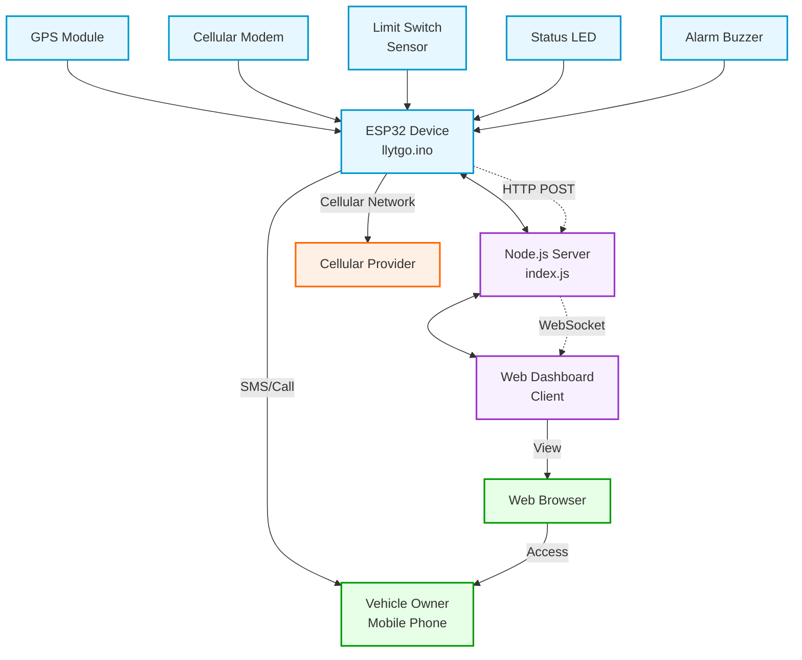
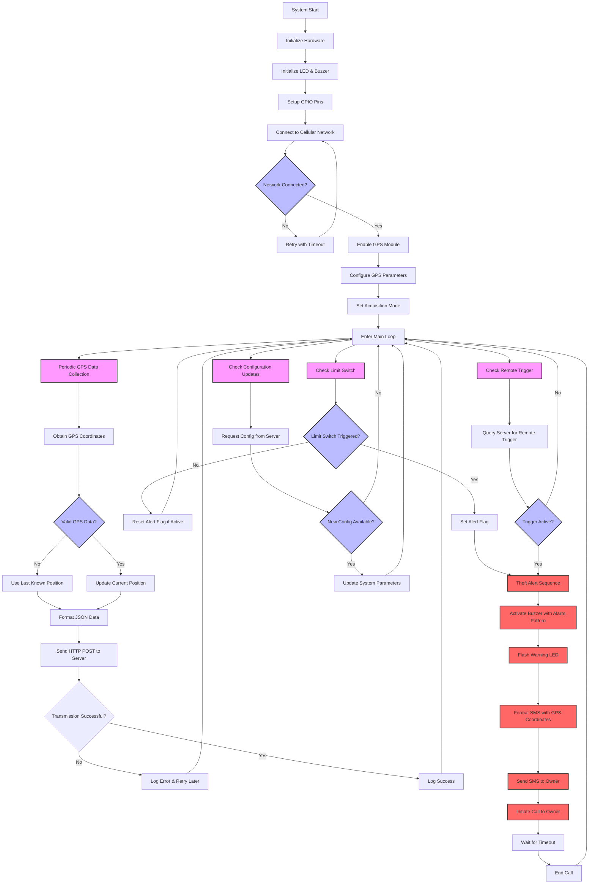
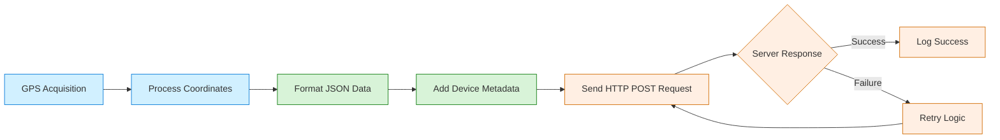
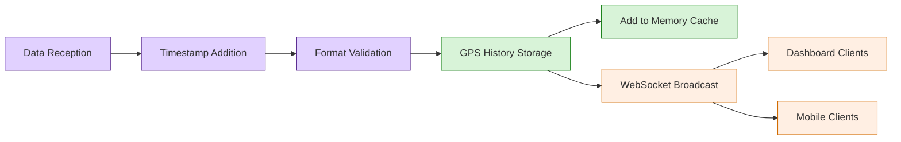
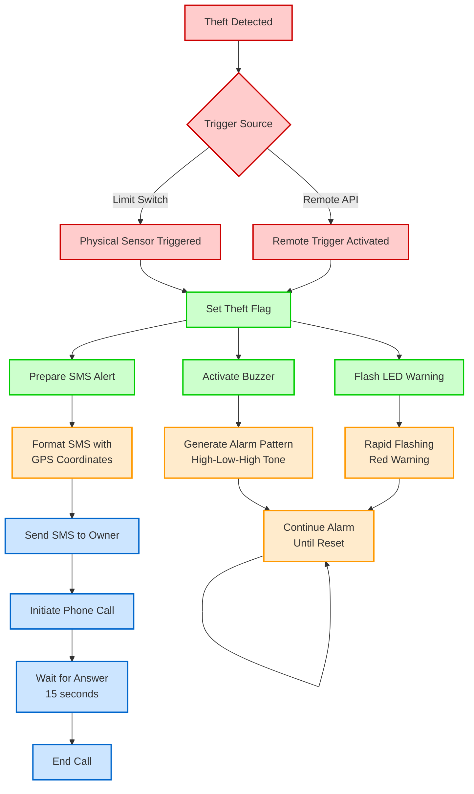

# Real-time GPS Vehicle Tracking System with Theft Detection

## Project Overview

This repository contains a comprehensive IoT solution for real-time vehicle tracking and theft detection. The system utilizes an ESP32 microcontroller with a SIM7600 cellular modem and GPS module to provide continuous location monitoring, while also implementing theft detection through a physical limit switch sensor and remote trigger capabilities.

The solution consists of three main components:
1. An ESP32-based hardware device for GPS tracking and cellular communication
2. A Node.js web server for data processing and storage
3. A web-based dashboard for real-time monitoring and control

## Table of Contents

- [System Architecture](#system-architecture)
- [Hardware Components](#hardware-components)
- [Software Components](#software-components)
- [Data Flow](#data-flow)
- [Communication Protocols](#communication-protocols)
- [Security Considerations](#security-considerations)
- [Installation and Setup](#installation-and-setup)
- [Configuration](#configuration)
- [Theft Detection Mechanism](#theft-detection-mechanism)
- [Future Improvements](#future-improvements)
- [Technical Specifications](#technical-specifications)

## System Architecture

The GPS tracking system follows a client-server architecture with real-time communication capabilities:



### Flowchart: System Operation Logic



## Hardware Components

| Component | Model | Description |
|-----------|-------|-------------|
| Microcontroller | ESP32 | Dual-core processor with built-in Wi-Fi and Bluetooth |
| Cellular/GPS Module | SIM7600 | 4G LTE module with integrated GPS receiver |
| SIM Card | Safaricom | Cellular data connectivity |
| Limit Switch | - | Physical sensor for theft detection |
| Buzzer | Piezoelectric | Audible alert during theft detection |
| LED | High-brightness | Visual indicator for system status and alerts |
| Power Supply | - | Battery or vehicle power connection |

### Pin Configuration

| ESP32 Pin | Component | Function |
|-----------|-----------|----------|
| GPIO 26 | SIM7600 | Rx (MODEM_RX) |
| GPIO 27 | SIM7600 | Tx (MODEM_TX) |
| GPIO 4 | SIM7600 | Power Key (MODEM_PWRKEY) |
| GPIO 23 | SIM7600 | Power On (MODEM_POWER_ON) |
| GPIO 5 | SIM7600 | Reset (MODEM_RST) |
| GPIO 34 | Limit Switch | Theft detection sensor (LIMIT_SWITCH_PIN) |
| GPIO 13 | Buzzer | Audible alarm output (BUZZER_PIN) |
| GPIO 12 | LED | Visual alert indicator (LED_PIN) |

## Software Components

### 1. ESP32 Firmware (`arduino/llytgo.ino`)

The firmware for the ESP32 microcontroller handles:
- GPS data acquisition
- Network connectivity
- HTTP communication with the server
- Theft detection via limit switch
- SMS/call alerts to the vehicle owner
- Audible alarm (buzzer) activation
- Visual alerts through LED indicators

**Key Dependencies:**
- TinyGSM Library
- ArduinoHttpClient Library
- TinyGPSPlus Library
- HardwareSerial Library

### 2. Server Application (`index.js`)

The Node.js server component:
- Processes incoming GPS data
- Maintains location history
- Serves the web dashboard
- Manages device configuration
- Facilitates bi-directional communication via WebSockets
- Handles remote theft triggers

**Key Dependencies:**
- Express.js
- ws (WebSocket)
- HTTP

### 3. Web Dashboard (`public/index.html` & `gps-locator/index.html`)

The web-based user interface:
- Displays real-time vehicle location on a map
- Shows movement history
- Provides theft simulation controls
- Allows configuration of phone numbers and SIM PIN
- Displays system status and alerts

**Key Dependencies:**
- Leaflet.js (Mapping)
- Tailwind CSS (Styling)

## Data Flow

### Outbound Data Flow (ESP32 to Server)

The ESP32 device collects GPS coordinates and sends them to the server:



**GPS Data Format:**
```json
{
  "lat": 0.2833,
  "lng": 35.3167,
  "sim": "+254114931050"
}
```

### Inbound Data Flow (Server to Dashboard)

The server processes GPS data and forwards it to all connected dashboard clients:



**WebSocket Message Format:**
```json
{
  "type": "gps",
  "payload": {
    "lat": 0.2833,
    "lng": 35.3167,
    "sim": "+254114931050",
    "timestamp": "2025-05-13T12:34:56.789Z"
  }
}
```

## Communication Protocols

| Protocol | Usage | Port |
|----------|-------|------|
| HTTP | GPS data transmission (ESP32 to Server) | 3000 |
| WebSocket | Real-time updates (Server to Dashboard) | 3000/80 |
| SMS | Theft alerts (ESP32 to Owner) | - |
| Cellular Call | Theft alerts (ESP32 to Owner) | - |

## Theft Detection Mechanism

The system implements two methods of theft detection:

1. **Physical Limit Switch**
   - Connected to GPIO 34 on the ESP32
   - Triggered when tampered with or removed
   - Immediately sends SMS and initiates a call to the owner

2. **Remote Trigger**
   - Dashboard interface allows manual triggering
   - Server sets a flag that the ESP32 periodically checks
   - Simulates a theft scenario for testing

**Theft Response Sequence:**



## Configuration

The system supports remote configuration via the web dashboard:

| Parameter | Default | Description |
|-----------|---------|-------------|
| Owner Number | +254714874451 | Phone number to receive theft alerts |
| SIM Number | +254114931050 | SIM card number in the device |
| SIM PIN | 6577 | PIN code for the SIM card |

Configuration changes are:
1. Saved on the server
2. Transmitted to the ESP32 during periodic checks
3. Used for subsequent operations

## Technical Specifications

### ESP32 Performance Metrics

| Metric | Value |
|--------|-------|
| GPS Polling Interval | 10 seconds |
| Config Check Interval | 60 seconds |
| Theft Check Interval | Continuous |
| GPS Retry Attempts | 3 |

### Server Capacity

| Metric | Value |
|--------|-------|
| Max GPS History | 100 entries |
| Supported Protocols | HTTP, WebSocket |
| Ports | 3000 (main), 80 (alternative) |

### Dashboard Features

The dashboard provides:
- Real-time location tracking
- Historical path visualization
- Theft simulation
- Remote configuration
- Alert notifications
- Battery and sensor status

## Installation and Setup

### Hardware Setup

1. Connect the SIM7600 module to the ESP32 according to the pin configuration
2. Attach the limit switch to GPIO 34
3. Insert a SIM card with data capabilities
4. Power the device using a suitable power source

### Server Setup

```bash
# Clone the repository
git clone https://github.com/username/gps-front-end.git

# Navigate to the project directory
cd gps-front-end

# Install dependencies
npm install

# Start the server
npm start
```

### ESP32 Firmware Installation

1. Install Arduino IDE or PlatformIO
2. Install required libraries:
   - TinyGSM
   - ArduinoHttpClient
   - TinyGPSPlus
3. Open the `arduino/llytgo.ino` file
4. Configure the server address and credentials
5. Upload the firmware to your ESP32

## Future Improvements

1. **Enhanced Security**
   - Implement HTTPS communication
   - Add authentication for dashboard access
   - Encrypt sensitive configuration data

2. **Extended Features**
   - Geofencing capabilities
   - Battery level monitoring
   - Motion detection alerts
   - Historical route analysis

3. **Optimizations**
   - Reduce power consumption for longer battery life
   - Improve GPS acquisition time
   - Implement more robust error handling and recovery

---

This project was developed as an academic demonstration of IoT applications in vehicle security and tracking. The implementation showcases integration of hardware sensors, cellular communication, web technologies, and real-time data processing in a practical application.
